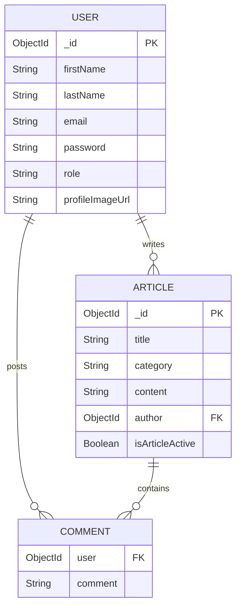

# ⚙️ Backend Architecture & API Documentation

This document serves as the complete technical documentation for the Blog Application backend.
It explains the backend architecture, folder structure, database schemas, authentication flow, middleware usage, package purposes, API contracts, deployment setup, and security implementation.

---

# 🏗️ 1. Architecture & System Flow

This backend is built using a scalable and modular **Node.js + Express.js** architecture.

## 🔄 Request Flow

```text
Client Request
      ↓
CORS Middleware
      ↓
Cookie Parser
      ↓
JWT Authentication Middleware
      ↓
API Routes
      ↓
Business Logic (Services)
      ↓
MongoDB Database
      ↓
Response Sent Back
```

---

## 🔐 Security Architecture

* JWT Authentication using HTTP-only Cookies
* Role-Based Authorization
* Password Hashing using Bcrypt
* Protected Routes using Middleware
* Secure Cross-Origin Requests
* Centralized Error Handling

---

# 🚀 2. Local Installation & Setup

## Step 1: Clone Repository

```bash
git clone :https://github.com/GundaSaiDeepthi/Blog_App
```

---

## Step 2: Move to Backend Folder

```bash
cd backend
```

---

## Step 3: Install Dependencies

```bash
npm install
```

---

## Step 4: Create `.env` File

```env
PORT=4000

DB_URL=your_mongodb_atlas_connection_string

JWT_SECRET_KEY=your_secret_key

CLOUD_NAME=your_cloudinary_cloud_name

API_KEY=your_cloudinary_api_key

API_SECRET=your_cloudinary_api_secret
```

---

## Step 5: Run Backend

### Development Mode

```bash
npx nodemon server.js
```

### Production Mode

```bash
node server.js
```

---

# 📂 3. Backend Project Structure

```text
backend/
│
├── APIs/
│   ├── AdminAPI.js
│   ├── AuthorAPI.js
│   ├── CommonAPI.js
│   └── UserAPI.js
│
├── config/
│   ├── cloudinary.js
│   ├── cloudinaryUpload.js
│   └── multer.js
│
├── middlewares/
│   └── verifyToken.js
│
├── models/
│   ├── ArticleModel.js
│   └── UserModel.js
│
├── services/
│   └── authService.js
│
├── .env
├── package.json
└── server.js
```

---

# 📦 4. Technology Stack & Package Evaluation

| Package         | Version   | Purpose                                          |
| :-------------- | :-------- | :----------------------------------------------- |
| `express`       | `^5.2.1`  | Creates backend server and REST APIs             |
| `mongoose`      | `^9.1.5`  | MongoDB ODM for schema modeling                  |
| `jsonwebtoken`  | `^9.0.3`  | Generates and verifies JWT tokens                |
| `bcryptjs`      | `^3.0.3`  | Hashes passwords securely                        |
| `cookie-parser` | `^1.4.7`  | Reads cookies from requests                      |
| `cors`          | `^2.8.6`  | Enables frontend-backend communication           |
| `multer`        | `^2.1.1`  | Handles image uploads                            |
| `cloudinary`    | `^2.9.0`  | Stores profile images in cloud                   |
| `dotenv`        | `^17.2.3` | Loads environment variables                      |
| `nodemon`       | `^3.1.11` | Automatically restarts server during development |

---

# 🗄️ 5. Database Schema Design

## 👤 User Schema

```js
{
  firstName: String,
  lastName: String,
  email: String,
  password: String,
  role: String,
  profileImageUrl: String,
  isActive: Boolean
}
```

---

## 📰 Article Schema

```js
{
  title: String,
  category: String,
  content: String,
  author: ObjectId,
  comments: [
    {
      user: ObjectId,
      comment: String
    }
  ],
  isArticleActive: Boolean
}
```

---

# 🔗 6. Entity Relationship Diagram



---

# 🌐 7. API Reference & Endpoints

# 🟢 Common APIs

Base URL:

```text
/common-api
```

| Method | Endpoint           | Purpose                     |
| :----- | :----------------- | :-------------------------- |
| POST   | `/login`           | Login user                  |
| GET    | `/logout`          | Logout user                 |
| PUT    | `/change-password` | Change password             |
| GET    | `/check-auth`      | Restore login after refresh |

---

# 🔵 User APIs

Base URL:

```text
/user-api
```

| Method | Endpoint    | Purpose                |
| :----- | :---------- | :--------------------- |
| POST   | `/users`    | Register user          |
| GET    | `/articles` | Fetch all articles     |
| PUT    | `/articles` | Add comment to article |

---

# 🟠 Author APIs

Base URL:

```text
/author-api
```

| Method | Endpoint               | Purpose                |
| :----- | :--------------------- | :--------------------- |
| POST   | `/users`               | Register author        |
| POST   | `/articles`            | Create article         |
| GET    | `/articles/:email`     | Fetch author articles  |
| PUT    | `/articles`            | Update article         |
| PUT    | `/articles/:articleId` | Delete/Restore article |

---

# 🔴 Admin APIs

Base URL:

```text
/admin-api
```

| Method | Endpoint          | Purpose            |
| :----- | :---------------- | :----------------- |
| GET    | `/users`          | Fetch all users    |
| GET    | `/articles`       | Fetch all articles |
| PUT    | `/block-user/:id` | Block user         |

---

# 🔐 8. Authentication System

Authentication is implemented using:

* JWT Tokens
* HTTP-only Cookies
* Cookie Parser
* Protected Middleware
* Role-Based Authorization

---

## 🍪 Cookie Configuration

```js
res.cookie("token", token, {
  httpOnly: true,
  secure: true,
  sameSite: "none",
});
```

---

# 🛡️ 9. Middleware Used

| Middleware       | Purpose                                  |
| :--------------- | :--------------------------------------- |
| `cors()`         | Enables secure frontend-backend requests |
| `express.json()` | Parses JSON request body                 |
| `cookieParser()` | Parses cookies                           |
| `verifyToken()`  | Protects routes                          |
| `multer()`       | Handles file uploads                     |

---

# ☁️ 10. Cloudinary Image Upload

Profile images are uploaded using:

* Multer Memory Storage
* Cloudinary SDK
* Buffer Uploads

---

## Supported Formats

* JPG
* PNG

---

## Maximum File Size

```text
2MB
```

---

# 🔒 11. Security Features

✅ JWT Authentication
✅ Password Hashing
✅ HTTP-only Cookies
✅ Role-Based Authorization
✅ Protected Routes
✅ Secure CORS Setup
✅ Input Validation
✅ Global Error Handling

---

# ⚠️ 12. Error Handling

Centralized error handling middleware handles:

* Validation Errors
* Duplicate Email Errors
* Invalid ObjectId Errors
* Authentication Errors
* Authorization Errors
* Server Errors

---

# 🚀 13. Deployment

## Backend Deployment

Platform: Render

🔗 Live Backend API:

[Blog App Backend Deployment](https://blog-app-1-n245.onrender.com)

---

## Frontend Deployment

Platform: Vercel

---

# 🔄 14. Authentication Flow

```text
User Login
    ↓
JWT Token Generated
    ↓
Token Stored in HTTP-only Cookie
    ↓
Protected Routes Verified
    ↓
Access Granted
```

---

# 👨‍💻 15. Developed Using

* Node.js
* Express.js
* MongoDB Atlas
* Mongoose
* JWT
* Cloudinary
* Render
* Vercel

---


### Backened Development

1. Create git repo
    git init 

2. Add .gitignore file

3. Create .env file for environment variables and read data from .env with "dotenv" module
    npm install dotenv

4. Generate package.json
    npm init -y 

5. Create Express app
    npm i express

6. Connect to DataBase

7. Add middlewares(body parser,err handling middlewares)

8. Design Schemas and Create Models

9. Design REST APIs for all resources


Registration & Login

10. Registration & Login in common for USER & AUTHOR. Create a seperate service to reuse

11. The Client wont send role. It just redirects to a specific API based on role selection. The hardcoded role assigned by API routes.