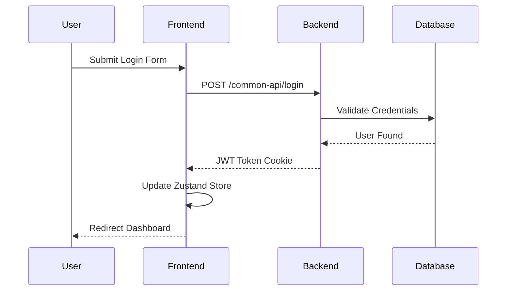
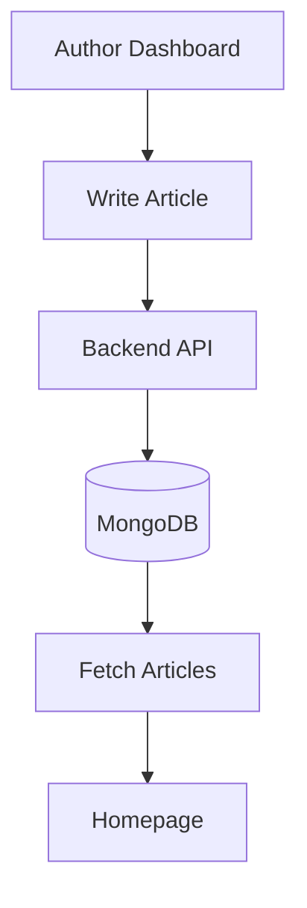
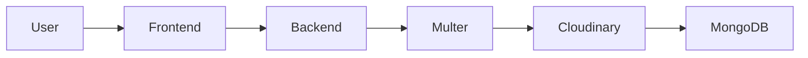

````md
<div align="center">

# 🎨 Frontend Architecture & UI Documentation

This document serves as the official frontend technical guide for the MERN Blog Application. It explains the client-side architecture, routing strategy, state management, authentication flow, UI rendering, and package ecosystem.

🌐 Live Frontend Deployment:  
🚀 https://blog-app-xi-flame.vercel.app/

</div>

---

# 🏗️ 1. Frontend Architecture Overview

The frontend is developed using **React + Vite** with a scalable component-based architecture.

The application follows modern frontend engineering principles:

- **Component-Based UI Rendering**
- **Centralized Authentication State**
- **Protected Route Navigation**
- **Reusable Styling System**
- **REST API Integration**
- **Responsive Design Principles**

---

# ⚡ 2. Frontend Technology Stack

| Technology | Purpose |
| :--- | :--- |
| **React.js** | Component-based UI development |
| **Vite** | Lightning-fast frontend build tool |
| **React Router** | Client-side routing |
| **Axios** | API communication |
| **React Hook Form** | Form handling & validation |
| **Zustand** | Lightweight global state management |
| **React Hot Toast** | Toast notifications |
| **Tailwind CSS** | Utility-first responsive styling |

---

# 🚀 3. Local Installation & Setup

## 📋 Prerequisites

- Node.js (v18+)
- Backend server running
- npm installed

---

## 📦 Install Frontend Dependencies

```bash
cd frontend
npm install
````

---

## ▶️ Start Frontend Server

```bash
npm run dev
```

Frontend runs on:

```bash
http://localhost:5173
```

---

# 🌐 4. Production Deployment

| Service       | Deployment    |
| :------------ | :------------ |
| Frontend      | Vercel        |
| Backend       | Render        |
| Database      | MongoDB Atlas |
| Media Storage | Cloudinary    |

---

# 📂 5. Frontend Project Structure

```text
frontend/
│
├── public/
│
├── src/
│   │
│   ├── components/
│   │   ├── Header.jsx
│   │   ├── Footer.jsx
│   │   ├── ArticleCard.jsx
│   │   ├── ProtectedRoute.jsx
│   │   └── Loader.jsx
│   │
│   ├── pages/
│   │   ├── Home.jsx
│   │   ├── Login.jsx
│   │   ├── Register.jsx
│   │   ├── WriteArticle.jsx
│   │   ├── UserProfile.jsx
│   │   ├── AuthorProfile.jsx
│   │   ├── AdminProfile.jsx
│   │   ├── ArticleDetails.jsx
│   │   ├── ChangePassword.jsx
│   │   └── NotFound.jsx
│   │
│   ├── store/
│   │   └── authStore.js
│   │
│   ├── styles/
│   │   └── common.js
│   │
│   ├── App.jsx
│   ├── main.jsx
│   └── index.css
│
├── package.json
├── vite.config.js
└── README.md
```

---

# 🔐 6. Authentication Flow

The application uses:

* JWT Authentication
* HTTP-Only Cookies
* Protected Routes
* Zustand State Persistence

---

## 🔄 Login Flow



---

# 🧠 7. Zustand Global State Management

The frontend uses **Zustand** for authentication and session persistence.

## Managed States

| State             | Purpose                       |
| :---------------- | :---------------------------- |
| `currentUser`     | Stores logged-in user details |
| `isAuthenticated` | Authentication status         |
| `loading`         | API loading state             |
| `error`           | Error handling                |

---

## Auth Features

* Login
* Logout
* Session Restore
* Role Persistence
* Protected Access

---

# 🔐 8. Role-Based UI Rendering

The frontend dynamically changes UI based on logged-in user role.

---

## 👤 USER

Can:

* Browse Articles
* Read Articles
* Comment on Articles
* Update Profile

---

## ✍️ AUTHOR

Can:

* Write Articles
* Edit Articles
* Soft Delete Articles
* Manage Own Dashboard

---

## 🛡️ ADMIN

Can:

* Manage Users
* Manage Articles
* Moderate Platform
* Access Admin Dashboard

---

# 📝 9. Article Management Flow



---

# 🖼️ 10. Image Upload System

Profile images are uploaded using:

* FormData
* Multer Memory Storage
* Cloudinary CDN

---

## Upload Flow



---

# 🎨 11. Styling System

The frontend uses:

* Tailwind CSS
* Shared reusable styles
* Responsive layouts
* Modern card-based UI
* Gradient backgrounds
* Utility-first architecture

---

# 📦 12. Frontend Package Documentation

| Package         | Purpose           |
| :-------------- | :---------------- |
| react           | UI library        |
| react-dom       | DOM rendering     |
| react-router    | Routing           |
| axios           | API requests      |
| zustand         | Global state      |
| react-hook-form | Form validation   |
| react-hot-toast | Notifications     |
| tailwindcss     | Styling framework |
| vite            | Build tool        |

---

# 🔗 13. API Integration

Frontend communicates with backend using Axios.

## Backend Base URL

```bash
https://blog-app-1-n245.onrender.com
```

---

## Common API Endpoints Used

| Method | Endpoint                 | Purpose             |
| :----- | :----------------------- | :------------------ |
| POST   | `/common-api/login`      | Login               |
| GET    | `/common-api/logout`     | Logout              |
| GET    | `/common-api/check-auth` | Restore Session     |
| POST   | `/user-api/users`        | User Registration   |
| POST   | `/author-api/users`      | Author Registration |
| GET    | `/user-api/articles`     | Fetch Articles      |
| POST   | `/author-api/articles`   | Create Article      |
| PUT    | `/user-api/articles`     | Add Comment         |

---

# 🔒 14. Protected Route System

Routes are protected based on:

* Authentication
* JWT Validation
* User Role

---

## Example

| Route             | Access      |
| :---------------- | :---------- |
| `/author-profile` | AUTHOR only |
| `/admin-profile`  | ADMIN only  |
| `/write-article`  | AUTHOR only |

---

# ⚠️ 15. Error Handling System

Frontend handles:

* Unauthorized Access
* Invalid Credentials
* Validation Errors
* Network Failures
* Duplicate Emails
* Upload Errors

Using:

* Toast Notifications
* Conditional Rendering
* Zustand Error State

---

# 📱 16. Responsive Design

The frontend supports:

* Desktop
* Tablet
* Mobile Devices

Implemented using:

* Tailwind breakpoints
* Flexible layouts
* Responsive cards
* Adaptive navigation

---

# 🌟 17. Key Features Summary

✅ JWT Authentication
✅ Role-Based Authorization
✅ Zustand State Management
✅ Cloudinary Image Uploads
✅ Secure Cookie Sessions
✅ Protected Routes
✅ Article CRUD Operations
✅ Comment System
✅ Responsive UI
✅ MERN Stack Architecture

---

# 🔗 18. Live Project Links

## 🌐 Frontend

[https://blog-app-xi-flame.vercel.app/](https://blog-app-xi-flame.vercel.app/)

---

## ⚙️ Backend

[https://blog-app-1-n245.onrender.com](https://blog-app-1-n245.onrender.com)

---


```
