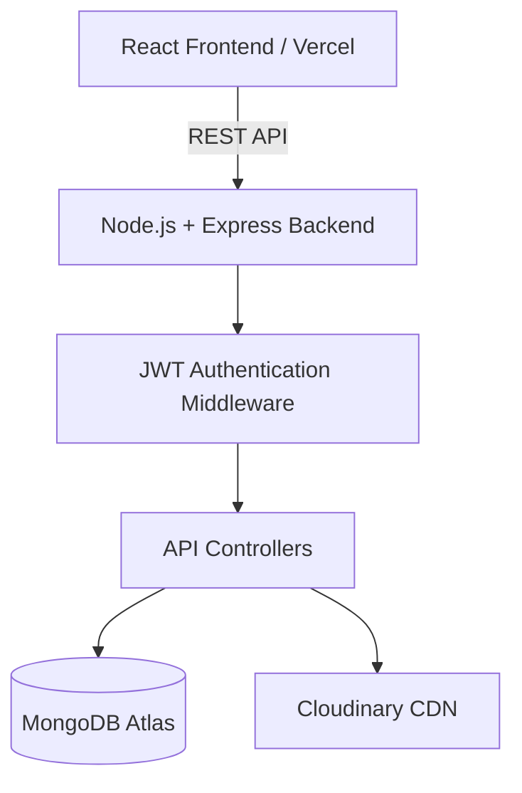

# ✍️ Full-Stack Role-Based Blog Application (MERN)

A modern, secure, and scalable blogging platform built using the **MERN Stack** with complete **Role-Based Access Control (RBAC)** implementation.
The application provides different dashboards and permissions for Readers, Authors, and Administrators while maintaining enterprise-level authentication and backend security practices.

🔗 Live Backend API:
[Blog App Backend API](https://blog-app-1-n245.onrender.com)

---

# 🌟 1. Project Vision & Core Features

This project is designed to demonstrate real-world full-stack development concepts including authentication, authorization, API development, database relationships, secure cookies, cloud image uploads, and scalable backend architecture.

---

## 🔐 Security & Authentication

* JWT Authentication using HTTP-only Cookies
* Role-Based Access Control (RBAC)
* Password Hashing using `bcryptjs`
* Protected Routes using Middleware
* Secure Cross-Origin Requests using CORS
* Persistent Login using Cookie-Based Authentication

---

## 📝 Content Management

* Authors can create, edit, and manage articles
* Users can browse articles and add comments
* Soft Delete Architecture using `isArticleActive`
* Category-based article organization
* Real-time article management flow

---

## ☁️ Cloud Image Upload

* Profile images uploaded using:

  * Multer Memory Storage
  * Cloudinary CDN
* Supports JPG and PNG formats
* Optimized cloud-hosted images

---

# 👥 2. Roles & Permissions (RBAC)

The application implements a complete three-level authorization system.

| Role       | Permissions                                                         |
| :--------- | :------------------------------------------------------------------ |
| **USER**   | Register, login, browse articles, comment on articles               |
| **AUTHOR** | USER permissions + create, edit, and manage own articles            |
| **ADMIN**  | Full system access including user management and article moderation |

---

# 📐 3. System Architecture & Request Flow



---

# 🗄️ 4. Database Design

## 👤 User Schema

```js id="7ahq9r"
{
  firstName: String,
  lastName: String,
  email: String,
  password: String,
  role: String,
  profileImageUrl: String,
  isActive: Boolean
}
```

---

## 📰 Article Schema

```js id="11v0h5"
{
  title: String,
  category: String,
  content: String,
  author: ObjectId,
  comments: [
    {
      user: ObjectId,
      comment: String
    }
  ],
  isArticleActive: Boolean
}
```

---

# 🚀 5. Installation & Setup

## 📋 Prerequisites

* Node.js
* MongoDB Atlas Account
* Cloudinary Account

---

# 🔧 Backend Setup

## Clone Repository

```bash id="c2dh4x"
git clone <your-github-repository-url>
```

---

## Move to Project

```bash id="a0nk4x"
cd blog-app
```

---

## Install Backend Packages

```bash id="0a0o6q"
cd backend
npm install
```

---

## Create `.env` File

```env id="9gycjc"
PORT=4000

DB_URL=your_mongodb_connection_string

JWT_SECRET_KEY=your_secret_key

CLOUD_NAME=your_cloudinary_name

API_KEY=your_cloudinary_api_key

API_SECRET=your_cloudinary_api_secret
```

---

## Start Backend

```bash id="97nv7v"
npx nodemon server.js
```

---

# 💻 Frontend Setup

## Install Frontend Packages

```bash id="bqcr0y"
cd frontend
npm install
```

---

## Start Frontend

```bash id="g9x4q0"
npm run dev
```

---

# 📂 6. Project Folder Structure

```text id="z4it9u"
blog-app/
│
├── backend/
│   ├── APIs/
│   ├── config/
│   ├── middlewares/
│   ├── models/
│   ├── services/
│   ├── server.js
│   └── package.json
│
├── frontend/
│   ├── components/
│   ├── pages/
│   ├── store/
│   ├── styles/
│   ├── App.jsx
│   └── main.jsx
```

---

# 📦 7. Technologies Used

## Backend

| Technology    | Purpose               |
| :------------ | :-------------------- |
| Node.js       | Runtime Environment   |
| Express.js    | Backend Framework     |
| MongoDB Atlas | Cloud Database        |
| Mongoose      | ODM for MongoDB       |
| JWT           | Authentication        |
| bcryptjs      | Password Hashing      |
| Multer        | File Upload           |
| Cloudinary    | Cloud Image Storage   |
| Cookie Parser | Cookie Handling       |
| CORS          | Cross-Origin Requests |

---

## Frontend

| Technology      | Purpose          |
| :-------------- | :--------------- |
| React.js        | Frontend Library |
| React Router    | Routing          |
| Zustand         | State Management |
| Axios           | API Calls        |
| React Hook Form | Form Handling    |
| Tailwind CSS    | Styling          |
| React Hot Toast | Notifications    |

---

# 🌐 8. API Endpoints

# 🟢 Common APIs

Base URL:

```text id="8lg0fi"
/common-api
```

| Method | Endpoint           | Purpose         |
| :----- | :----------------- | :-------------- |
| POST   | `/login`           | Login user      |
| GET    | `/logout`          | Logout user     |
| GET    | `/check-auth`      | Restore login   |
| PUT    | `/change-password` | Change password |

---

# 🔵 User APIs

Base URL:

```text id="5msmkn"
/user-api
```

| Method | Endpoint    | Purpose            |
| :----- | :---------- | :----------------- |
| POST   | `/users`    | Register user      |
| GET    | `/articles` | Fetch all articles |
| PUT    | `/articles` | Add comments       |

---

# 🟠 Author APIs

Base URL:

```text id="8cqqk7"
/author-api
```

| Method | Endpoint               | Purpose                |
| :----- | :--------------------- | :--------------------- |
| POST   | `/users`               | Register author        |
| POST   | `/articles`            | Create article         |
| GET    | `/articles/:email`     | Fetch author articles  |
| PUT    | `/articles`            | Edit article           |
| PUT    | `/articles/:articleId` | Delete/Restore article |

---

# 🔴 Admin APIs

Base URL:

```text id="o6p2kg"
/admin-api
```

| Method | Endpoint          | Purpose        |
| :----- | :---------------- | :------------- |
| GET    | `/users`          | Fetch users    |
| GET    | `/articles`       | Fetch articles |
| PUT    | `/block-user/:id` | Block user     |

---

# 🔒 9. Authentication Flow

```text id="i5gjov"
User Login
     ↓
JWT Token Generated
     ↓
Token Stored in HTTP-only Cookie
     ↓
verifyToken Middleware Validates User
     ↓
Protected Route Access Granted
```

---

# 🍪 10. Cookie Configuration

```js id="q2lz1z"
res.cookie("token", token, {
  httpOnly: true,
  secure: true,
  sameSite: "none",
});
```

---

# ☁️ 11. Deployment

## Backend Deployment

Platform: Render

🔗 Backend URL:

[Render Backend Deployment](https://blog-app-1-n245.onrender.com?utm_source=chatgpt.com)

---

## Frontend Deployment

Platform: Vercel

---

# 🛡️ 12. Security Features

✅ JWT Authentication
✅ HTTP-only Cookies
✅ Password Hashing
✅ Role-Based Authorization
✅ Protected APIs
✅ Global Error Handling
✅ Secure Image Upload
✅ Cross-Origin Security

---

# ⚡ 13. Key Learning Outcomes

* Full MERN Stack Development
* JWT Authentication
* REST API Development
* MongoDB Relationships
* Role-Based Authorization
* Secure Cookie Authentication
* Cloudinary Integration
* Protected Route Handling
* Zustand State Management
* Deployment using Render & Vercel

---

<div align="center">


